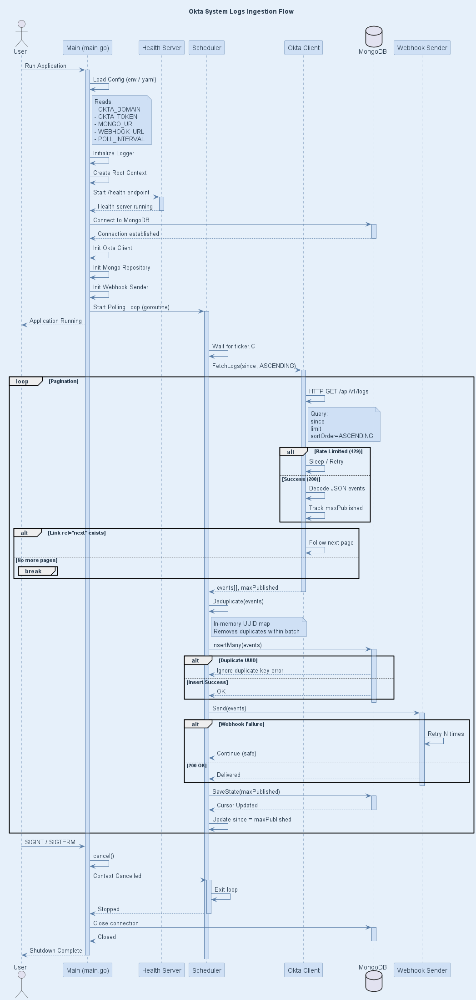

# okta-ingestor

# Okta System Logs Ingestor


## Description
The **Okta System Logs Ingestor** is a robust, stateful Go service designed to continuously fetch System Logs from Okta via pagination, store them securely in MongoDB, and forward them to an external Webhook. It is built for high reliability in enterprise environments (such as SIEM/SOAR integrations), ensuring zero data loss and exactly-once processing.

**Key Features:**
* **Stateful Pagination:** Tracks the latest `maxPublished` timestamp and cursor in MongoDB to resume exactly where it left off after a restart.
* **Resilient Polling Loop:** Handles Okta API Rate Limiting (HTTP 429) with sleep/retry mechanisms.
* **Zero Duplicates:** Uses a two-step deduplication process: in-memory UUID mapping for batch duplicates, and MongoDB `_id` mapping to silently ignore `11000` duplicate key errors.
* **Webhook Retry Logic:** Implements an N-time retry mechanism for failed webhook deliveries.
* **Graceful Shutdown:** Intercepts `SIGINT`/`SIGTERM` to safely cancel contexts, stop the scheduler, and close database connections without interrupting in-flight database transactions.

## Visuals
### Architecture & Ingestion Flow
*(Ensure your `sequence.png` file is placed in the root or `docs/` folder of your repository so it renders here)*



## Installation

### Requirements
* **Go** (v1.19 or higher)
* **MongoDB** (Running locally on port 27017, or a remote cluster)
* **Okta API Token** (With `System Logs: Read` permissions)

### Steps
1. Clone the repository:
   ```bash
   git clone [https://github.com/your-org/okta-ingestor.git](https://github.com/your-org/okta-ingestor.git)
   cd okta-ingestor


```

2. **Download dependencies:**
```bash
go mod tidy

```


3. **Configure the environment:**
Open `internal/config/config.go` and update your target environment details. **Note: The `StartDate` must be in strict UTC format (Zulu time).**
```go
OktaDomain:   "[https://trial-5020092.okta.com](https://trial-5020092.okta.com)",
OktaToken:    "YOUR_OKTA_API_TOKEN", 
MongoURI:     "mongodb://localhost:27017",
WebhookURL:   "[https://my-okta-logs.free.beeceptor.com](https://my-okta-logs.free.beeceptor.com)",
PollInterval: 30 * time.Second,
BatchSize:    100,
StartDate:    "2026-02-01T00:00:00.000Z", 

```


## Usage

Start the ingestor application from the root directory:

```bash
go run main.go

```

**Expected Console Output:**

```text
2026/03/02 10:41:00 Starting health check server on :8080
2026/03/02 10:41:00 Starting scheduler. Polling every 30s...
2026/03/02 10:41:00 Asking Okta for next batch...
2026/03/02 10:41:01 Successfully fetched 100 logs. Latest Timestamp: 2026-02-01T12:00:00.000Z
2026/03/02 10:41:01 Saved to MongoDB successfully.
...
2026/03/02 10:41:44 No new logs found. Caught up to present time!

```

**Health Check Verification:**

```bash
curl http://localhost:8080/health
# {"status": "ok"}

```

## Support

For issues regarding API rate limits, database connectivity, or Okta token expiration, please check the console logs first. If the issue persists, open a ticket in the repository's issue tracker with the attached error logs and timestamps.

## Roadmap

* [ ] Migrate configuration from hardcoded Go structs to `.env` or `.yaml` file loading (e.g., using Viper).
* [ ] Implement exponential backoff for Webhook `Send()` failures.
* [ ] Add Prometheus metrics to track ingestion lag and rate-limit hits.
* [ ] Containerize the application using Docker and provide a `docker-compose.yml` for simplified local testing.

## Contributing

Contributions are welcome, especially those that improve the ingestor's resilience or data parsing capabilities.

1. Fork the repository and create your feature branch.
2. Ensure you write and pass **Unit Test Cases (UTCs)** for any new logic.
3. Verify your changes maintain a high test coverage threshold:
```bash
# Run isolated Unit Tests
go test -short ./...

# Run Integration Tests (Requires local MongoDB instance)
go test -tags=integration ./...

```


4. Commit your changes and open a Pull Request.

## Authors and acknowledgment

* Built by the core engineering team for the Torq Integration Project.
* Special thanks to the architecture team for the flow designs.

## License

This project is licensed under the MIT License. See the `LICENSE` file for full details.

## Project status

**Active Development.** The core polling loop, MongoDB state management, and Okta API pagination logic are fully operational. Current focus is expanding test coverage and environment variable integration.
